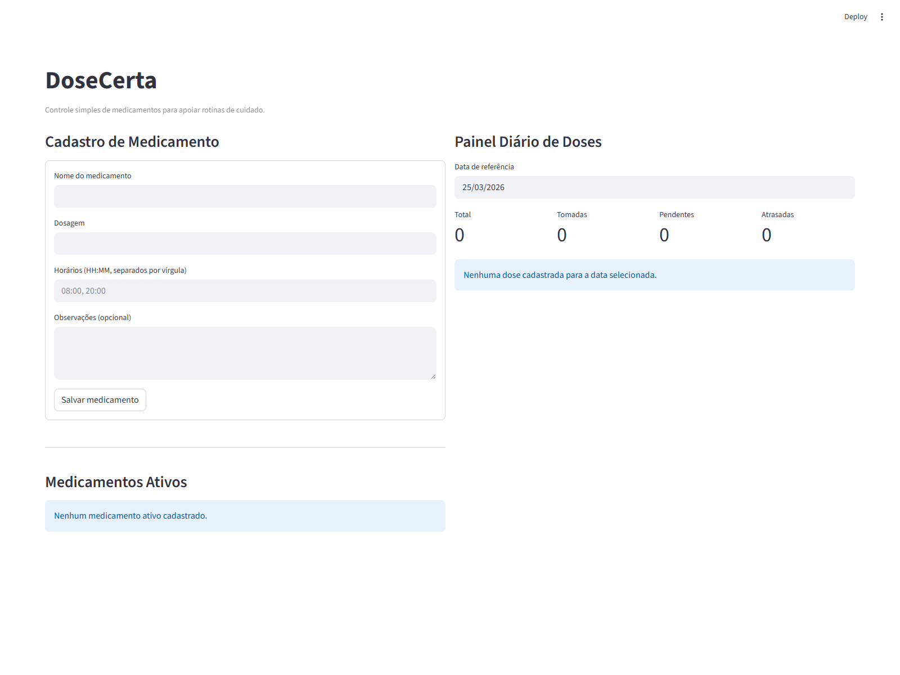

# DoseCerta

[](https://github.com/luccacampelo/dose-certa/actions/workflows/ci.yml)

O DoseCerta nasceu de uma dor simples e muito comum: lembrar os horarios corretos dos remedios no dia a dia.
A proposta do projeto e oferecer uma interface direta para registrar medicamentos, acompanhar doses e reduzir esquecimentos.

## Problema real
Em muitas casas, a rotina de medicacao depende de memoria, anotacoes soltas ou mensagens.
Quando o cuidado fica concentrado em uma pessoa, e facil perder horario ou ficar na duvida se a dose ja foi tomada.

## Proposta da solucao
O aplicativo organiza medicamentos por horario e mostra, para cada dia, o que esta:
- Pendente
- Atrasado
- Tomado

Com isso, o fluxo fica claro para quem cuida e para quem toma o medicamento.

## Publico-alvo
- Cuidadores familiares
- Pessoas idosas com rotina de medicacao
- Pessoas com uso continuo de remedios

## Funcionalidades principais
- Cadastro de medicamento (nome, dosagem, horarios e observacoes)
- Listagem de medicamentos ativos
- Painel diario com status de cada dose
- Registro de dose tomada
- Persistencia local em arquivo JSON

## Tecnologias utilizadas
- Python 3.12+
- Streamlit (GUI web local)
- Pytest (testes automatizados)
- Ruff (lint / analise estatica)
- GitHub Actions (CI)

## Estrutura do projeto
```text
dose-certa/
|- .github/workflows/ci.yml
|- .github/workflows/repo-guard.yml
|- .streamlit/config.toml
|- src/dose_certa/
|  |- __init__.py
|  |- app.py
|  |- service.py
|  `- storage.py
|- tests/test_service.py
|- tests/test_storage.py
|- README.md
|- SECURITY.md
|- pyproject.toml
|- requirements.txt
|- requirements-dev.txt
|- VERSION
`- LICENSE
```

## Instalacao
### Windows (PowerShell)
```powershell
python -m venv .venv
.venv\Scripts\Activate.ps1
python -m pip install --upgrade pip
python -m pip install -r requirements-dev.txt
```

## Execucao da aplicacao
```powershell
$env:PYTHONPATH = "src"
streamlit run src/dose_certa/app.py
```

Depois, abra no navegador o endereco exibido no terminal (normalmente `http://localhost:8501`).

## Rodar os testes
```powershell
$env:PYTHONPATH = "src"
pytest -q -p no:cacheprovider
```

## Rodar o lint
```powershell
ruff check --no-cache .
```

## Evidencia de funcionamento (exemplo)
```text
1) Cadastrar "Losartana 50mg" com horarios 08:00, 20:00
2) Abrir painel diario
3) Marcar dose de 08:00 como tomada
4) Ver resumo: Tomadas: 1 | Pendentes: 1 | Atrasadas: 0
```

### Print da interface


## Versionamento semantico
Versao atual: `1.0.0`.
A versao tambem esta declarada em `VERSION` e `pyproject.toml`.

## Autor
LUCCA DOS SANTOS CAMPELO SERPA

## Link do repositorio publico
https://github.com/luccacampelo/dose-certa

## Deploy publico seguro (recomendado)
Para uso publico por outras pessoas, publique no Streamlit Community Cloud (ambiente isolado).

1. Acesse: https://share.streamlit.io/
2. Clique em `New app`
3. Selecione:
   - Repository: `luccacampelo/dose-certa`
   - Branch: `main`
   - Main file path: `src/dose_certa/app.py`
4. Clique em `Deploy`

Isso gera um link publico no formato `https://<nome>.streamlit.app`.

## Fluxo de colaboracao (exemplo)
1. Criar branch de feature a partir da `main`.
2. Implementar a melhoria e validar com lint e testes.
3. Abrir Pull Request para revisao.
4. Fazer merge na `main` apos aprovacao.

## Manutencao evolutiva com seguranca
1. Criar branch por funcionalidade/correcao.
2. Rodar `ruff` e `pytest` antes de subir.
3. Abrir Pull Request e revisar diff.
4. O workflow `repo-guard` bloqueia arquivos sensiveis/temporarios no Git.
5. Dados de execucao ficam fora de versionamento (`data/*.json` e `data/_test/`).
